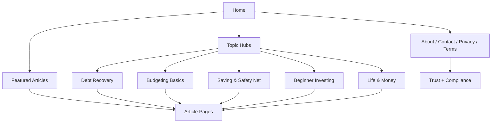

# Design Document

## Overview

本次改造的目标是把现有静态站点重构为一个更像真实个人作者持续经营的单主题出版站：**MoneyMind by Jake Miller**。站点主题保持为个人理财，但表达方式要明显摆脱“AI 批量生成内容站”的感觉，重点强化单作者可信度、内容分层、专题集群、自然语气和真实细节。

本次设计不引入 CMS、不引入复杂构建流程，仍保持静态 HTML 站点的简洁结构。优先处理品牌统一、站点信息一致性、专题化内容骨架、广告前合规整理，以及会让站点看起来像模板站或 AI 站的表述。

## Steering Document Alignment

### Technical Standards (tech.md)
- 保持静态 HTML 架构，不引入不必要的依赖或运行时复杂度。
- 统一页面头部、导航、页脚、元信息与结构化数据，减少站内不一致。
- 优先删除低价值或误导性内容，而不是为了“填满页面”而增加噪音。
- 所有修改围绕当前明确目标展开：提升 AdSense 过审友好度与真实出版站观感。

### Project Structure (structure.md)
- 继续沿用现有文件组织：`index.html`、`blog.html`、`about.html`、`contact.html`、`privacy-policy.html`、`terms-of-service.html`、`robots.txt`、`sitemap.xml`、`ads.txt`。
- 文章页面继续保留在 `blog/` 下，但需要按专题和内容质量重新组织。
- 新增的专题页或信任页应尽量保持与现有静态页面一致的命名和链接风格。

## Code Reuse Analysis

### Existing Components to Leverage
- **全站 header/footer 结构**：现有页面已经有统一导航和页脚雏形，可直接规范化后复用。
- **文章详情页模板**：`blog/*.html` 的文章结构可作为基础，但需要统一作者、语气和专题归属。
- **CSS 样式体系**：`styles.css` 继续作为唯一样式入口，避免新增框架。

### Integration Points
- **首页与博客页**：作为专题入口与精选内容入口，承担站点定位表达。
- **About / Contact / Privacy / Terms**：作为信任页和合规页，统一为同一作者叙事。
- **sitemap.xml / robots.txt / ads.txt**：作为爬取与 AdSense 合规基础设施。

## Architecture

站点采用“单作者出版站 + 专题内容集群”的结构。

核心层次如下：
1. **品牌层**：统一为 MoneyMind by Jake Miller，避免站点名、作者名、口吻分裂。
2. **首页层**：说明“谁在写、写什么、为什么可信”，并引导到专题。
3. **专题层**：按 Debt Recovery、Budgeting Basics、Saving & Safety Net、Beginner Investing、Life & Money 五个方向组织文章。
4. **文章层**：每篇文章保持独立主题、自然写法和具体经历感，但统一为同一作者视角。
5. **信任与合规层**：About、Contact、Privacy、Terms、ads.txt、sitemap、robots 保持一致且完整。

### Modular Design Principles
- **Single File Responsibility**：每个页面只承担一个明确职责，例如首页负责定位，博客页负责专题导览，About 负责作者可信度。
- **Component Isolation**：专题块、文章卡片、信任页模块保持清晰边界，避免一个页面包揽所有功能。
- **Service Layer Separation**：在静态站点中体现为“内容、信任、合规”三层分离，而不是混在一起。
- **Utility Modularity**：复用统一的标题、摘要、元信息、内链和页脚模式，但不强制所有文章完全同模版。



## Components and Interfaces

### 1. Brand System
- **Purpose:** 统一站点名称、作者身份、页面口吻和视觉称谓。
- **Interfaces:** 页面标题、meta、导航文案、页脚文案、结构化数据中的 `name` / `author` / `siteName`。
- **Dependencies:** 首页、About、博客页、文章页、法务页。
- **Reuses:** 现有静态页面与 SEO 标签。

### 2. Homepage Layout
- **Purpose:** 快速回答“你是谁、写什么、为什么可信”。
- **Interfaces:** Hero、作者简介、专题入口、精选文章、最近更新、信任页入口。
- **Dependencies:** 文章摘要、专题结构、作者说明。
- **Reuses:** 现有首页布局和卡片式区块。

### 3. Topic Hub System
- **Purpose:** 用专题组织文章，而不是让博客页像杂乱目录。
- **Interfaces:** 专题标题、简述、代表文章、推荐阅读顺序。
- **Dependencies:** 文章归类、内部链接、博客列表数据。
- **Reuses:** 现有 blog 页文章卡片和过滤区。

### 4. Trust Pages
- **Purpose:** 建立真实作者感与合规完整性。
- **Interfaces:** About、Contact、Privacy、Terms 页面内容。
- **Dependencies:** 统一作者身份、联系方式、站点定位、隐私披露。
- **Reuses:** 现有页面骨架。

### 5. Article Rewrite Layer
- **Purpose:** 降低模板感和 AI 感，提升具体性与自然度。
- **Interfaces:** 标题、导语、段落节奏、实例、结尾、内链。
- **Dependencies:** 专题归属、作者声音、可验证事实。
- **Reuses:** 现有文章页面结构和基础内容。

## Data Models

### Site Identity Model
```text
- siteName: MoneyMind
- authorName: Jake Miller
- brandVoice: personal, calm, practical, experienced
- positioning: single-author personal finance publication
- primaryTopic: personal finance
- topics: debt recovery, budgeting, saving, beginner investing, life and money
```

### Article Model
```text
- title: string
- slug: string
- topic: string
- author: Jake Miller
- publishDate: string
- readTime: string
- summary: string
- voiceNotes: string[]
- internalLinks: string[]
```

### Trust Page Model
```text
- pageType: about | contact | privacy | terms
- siteName: string
- authorName: string
- purpose: string
- complianceNotes: string[]
```

## Error Handling

### Error Scenarios
1. **品牌信息不一致**
   - **Handling:** 全站统一品牌与作者字段，避免同页出现多个站名或作者名。
   - **User Impact:** 用户不会看到拼接痕迹，站点看起来更像单一出版物。

2. **文章语气过于模板化**
   - **Handling:** 重写标题、开头和结尾，加入具体场景、决策过程和有限度的个人细节。
   - **User Impact:** 内容更像真实作者手写，而不是批量生成。

3. **广告/合规信号过强**
   - **Handling:** 先移除页面广告位占位，保留必要的政策和站点文件。
   - **User Impact:** 站点更像内容出版站，而不是为了广告而搭建的壳子。

4. **专题边界不清**
   - **Handling:** 每篇文章明确归属一个主专题，首页和博客页只暴露有限数量的专题入口。
   - **User Impact:** 用户更容易理解站点主题，也更容易建立信任。

## Testing Strategy

### Unit Testing
- 对于静态站点，重点是内容和结构审查而非传统单元测试。
- 检查所有页面标题、作者、canonical、OG、Twitter、结构化数据的一致性。

### Integration Testing
- 验证首页、博客页、About、Contact、Privacy、Terms、文章页之间的内链和导航一致性。
- 验证 sitemap、robots、ads.txt 与实际页面同步。

### End-to-End Testing
- 人工检查首屏是否像真实单作者出版站。
- 检查博客页是否像专题导览，而不是泛内容目录。
- 检查文章是否避免“AI 很像 AI”的模板化表达。
- 检查移动端和桌面端的整体可信度与可读性。
